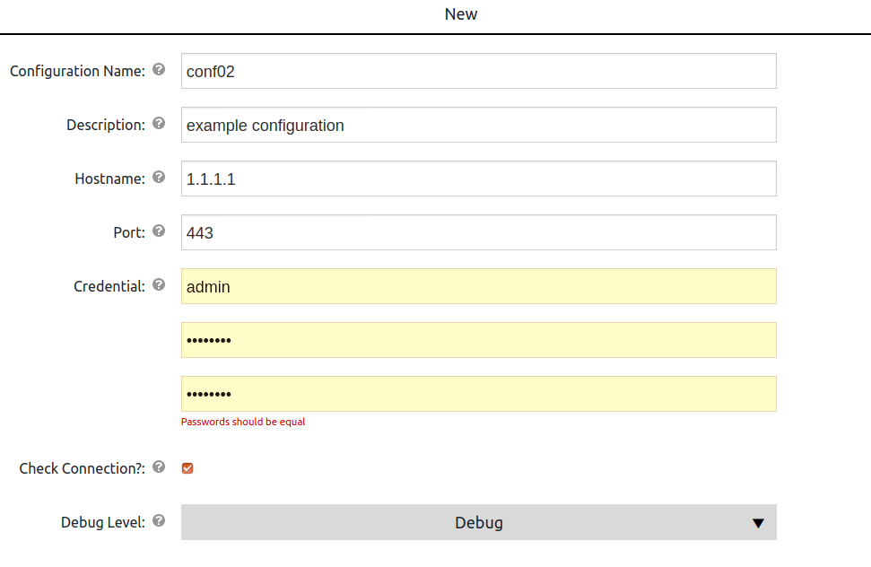
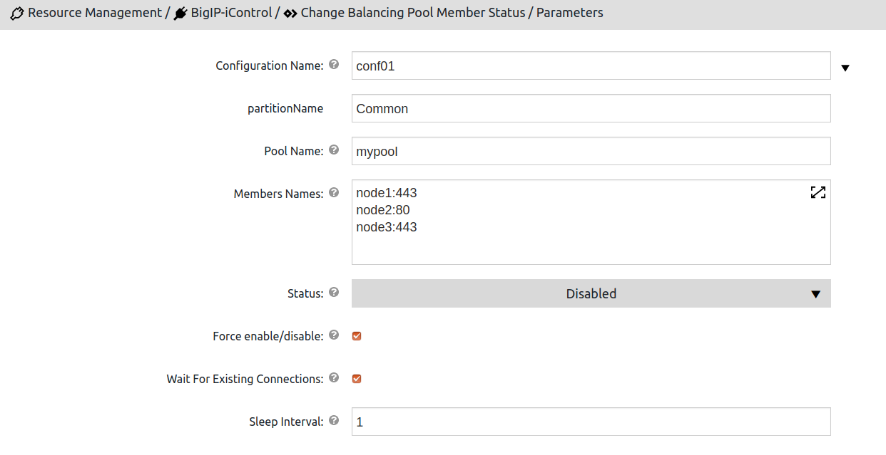
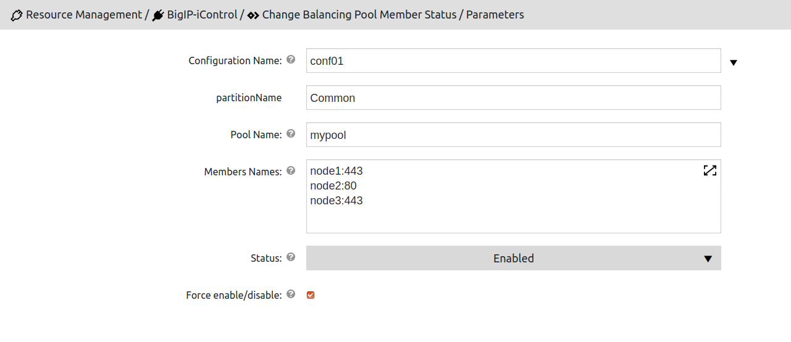

Plugin version 1.0.0

Revised on October 12, 2020

== Overview

This plugin allows to work with F5 Big-IP via iControl SOAP API.

== Plugin Configurations
Plugin configurations are sets of parameters that apply
across some or all of the plugin procedures. They
reduce repetition of common values, create
predefined parameter sets for end users, and
securely store credentials where needed. Each configuration
is given a unique name that is entered in designated
parameters on procedures that use them.

=== Creating Plugin Configurations
To create plugin configurations in CloudBees CD, do these steps:

* Go to **Administration** &gt;**Plugins** to open the Plugin Manager.
* Find the BigIP-iControl-1.0.0 row.
* Click *Configure* to open the
     Configurations page.
* Click *Create Configuration* as per the description of parameters below.

=== Configuration Procedure Parameters
[cols=",",options="header",]
|===
|Parameter |Description

|Configuration Name | The name for the created configuration

|Description | Description for the configuration

|Hostname | Host name or IP address of the BigIP instance.

|Port | Port number of the BigIP instance. Please use 443 for HTTPS connection.

|Credential | Username and password to connect to your BigIP instance.

|Check Connection? | If checked, the connection endpoint and credentials entered as part of the configuration will be tested. If this option is checked, configuration will not be saved if the test fails.

|Debug Level | This option sets debug level for logs. If info is selected, only summary information will be shown, for debug, there will be some debug information and for trace the whole requests and responses will be shown.

|===

== Configuration Form

[[procedures]]
== Plugin Procedures

<b>IMPORTANT</b> For all parameter descriptions in this section, required parameters are shown in bold italics. 

[[ChangeBalancingPoolMemberStatus]]
=== Change Balancing Pool Member Status

This procedure will turn the specified pool members on and off.

==== Change Balancing Pool Member Status Parameters
[cols=",",options="header",]
|===
| Parameter | Description

| Configuration Name | Previously defined configuration for the plugin

| Partition Name | Name of the partition, e.g. Common.

| Pool Name | Name of the balancing pool, e.g. mypool.

| Members Names | Names of the members in format: "node name":"port" one per line
Example:
  abc_node:80
  def_node:443

| Status | Desired status of the pool member.
Details:

 *  https://devcentral.f5.com/articles/icontrol-rest-working-with-pool-members[iControl REST: Working with Pool Members] 
 *  https://support.f5.com/csp/article/K13310[K13310: Disabling nodes or pool members for maintenance (11.x - 14.x)] 

| Force Connection Online/Offline | If checked, the connection monitors will be forced online/offline.

| Wait For Existing Connections | If checked, the procedure will wait until all existing connections are closed.

| Sleep Interval | Amount of seconds to wait between active connections checks.

|===

== Change Balancing Pool Member Status Form

[[rns]]
== Release notes

=== BigIP-iControl 1.0.0

- Initial Version. The following procedures were added:
<ul>
    <li>Change Balancing Pool Member Status</li>
</ul>

